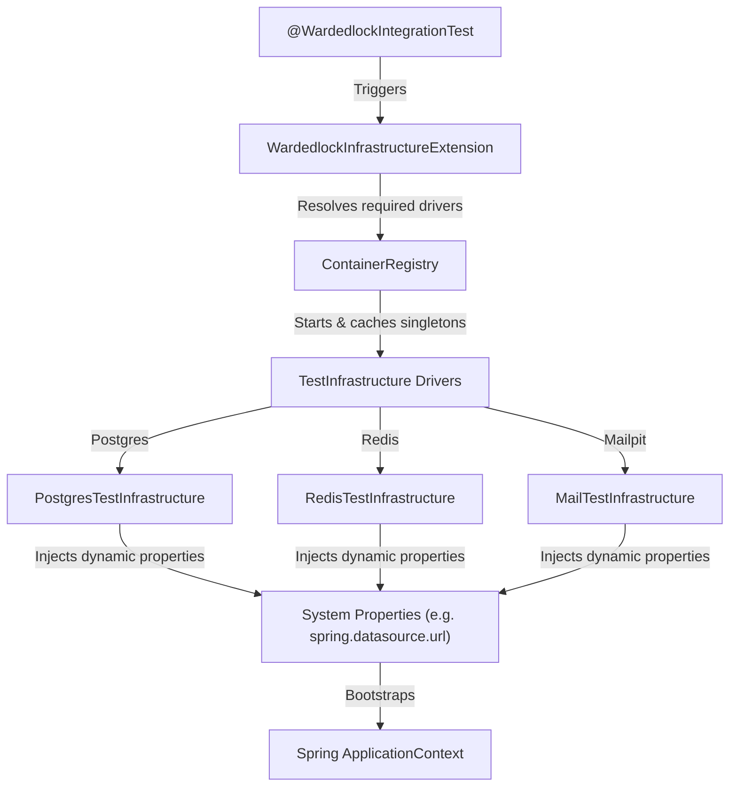

# WardedLock Test Infrastructure Specification

This document defines the dynamically orchestrated test infrastructure in the WardedLock monorepo.

---

## 1. Core Architecture

WardedLock uses **lazy-singleton Testcontainers** to isolate integration test suites. Docker containers spin up on randomized host ports, dynamically map their connection properties to Java System properties, and bootstrap the Spring Boot environment without requiring static YAML configuration.



---

## 2. Dynamic Configuration Registry

Connection parameters are injected programmatically before the Spring context starts, bypassing the need for an active `application-test.yml`.

| Driver | Container Image | Injected System Properties | Target Schema / Port |
| :--- | :--- | :--- | :--- |
| **PostgresTestInfrastructure** | `postgres:18-alpine` | `spring.datasource.url`<br>`spring.datasource.username`<br>`spring.datasource.password` | Dynamic database instance running alpine. Migrations are executed dynamically via Flyway against individual microservice schemas (`wl_account`, `wl_auth`, etc.). Spring Boot auto-configures Flyway from the datasource properties. |
| **RedisTestInfrastructure** | `redis:8-alpine` | `spring.data.redis.host`<br>`spring.data.redis.port` | Isolated cache instance. |
| **MailTestInfrastructure** | `axllent/mailpit:v1.18` | `spring.mail.host`<br>`spring.mail.port` | Isolated SMTP test instance. |

---

## 3. Bypassing Infrastructure (Quick Loop)

To run unit tests exclusively without initiating Docker containers:

- **Gradle Parameter**: `./gradlew test -PskipInfrastructureTests`
- **System Property**: `./gradlew test -Dwardedlock.test.skipInfrastructure=true`

*Note: The `wardedlock.test-conventions` plugin parses these flags to exclude classes carrying `@Tag("infrastructure")`.*

---

## 4. Extending the Registry

To register a new container driver:

1. **Implement `TestInfrastructure`**:
   
   ```java
   public class KafkaTestInfrastructure implements TestInfrastructure {
       private static final KafkaContainer CONTAINER = new KafkaContainer(DockerImageName.parse("confluentinc/cp-kafka:7.5.0"));

       @Override
       public void start() {
           if (!CONTAINER.isRunning()) {
               CONTAINER.start();
               System.setProperty("spring.kafka.bootstrap-servers", CONTAINER.getBootstrapServers());
           }
       }
   }
   ```

2. **Use in tests**:
   
   ```java
   @WardedlockIntegrationTest(infrastructure = { KafkaTestInfrastructure.class })
   class MessageFlowApplicationTests {}
   ```
